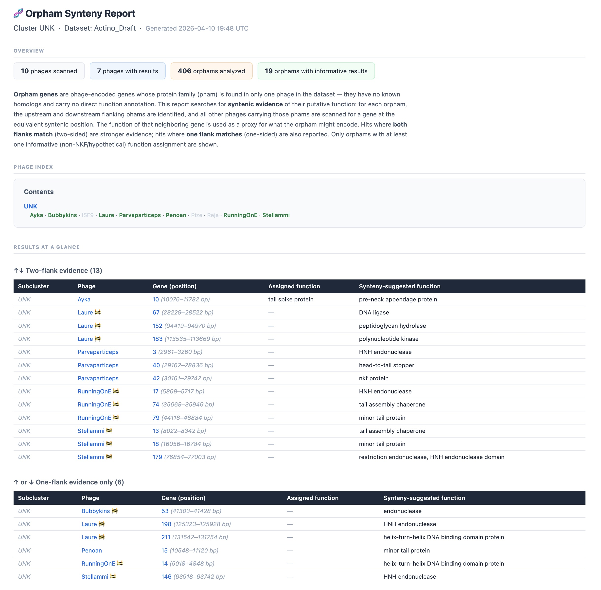
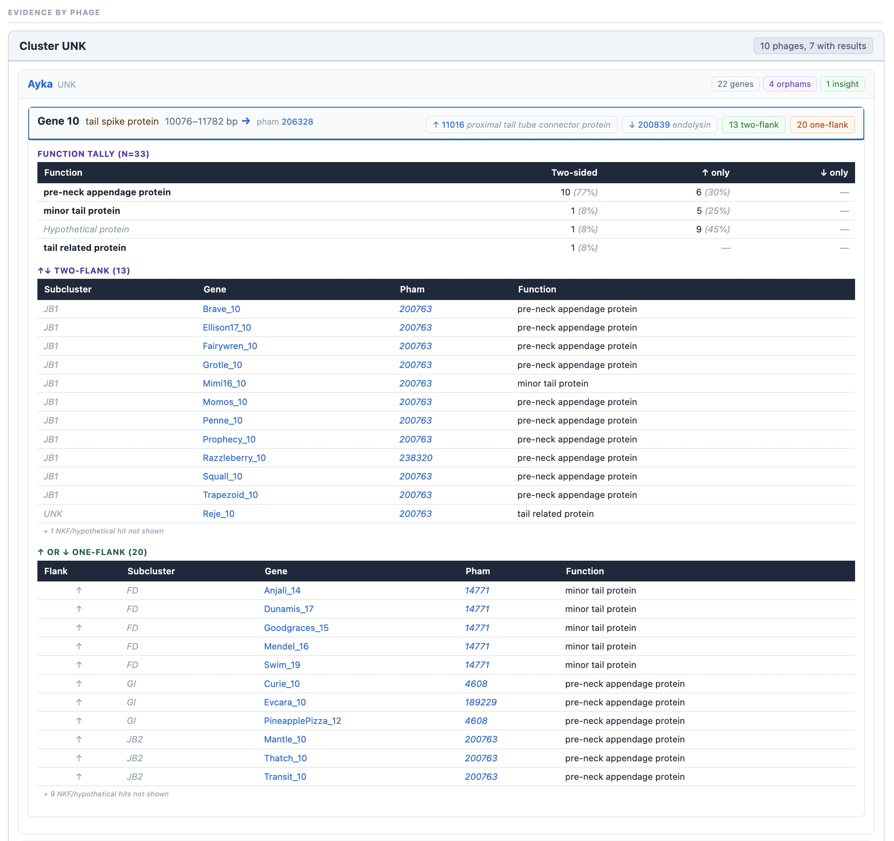

# Phage Synteny Tools

A collection of tools for synteny-based phage genome annotation, built around the [Phamerator](https://phamerator.org) database.

## Data & licensing

The database underlying this project is scraped from [Phamerator](https://phamerator.org) and [PhagesDB](https://phagesdb.org). Use of either service, regardless of where it occurs, constitutes your agreement to their terms, which notably include:

> Users are permitted to access, view, and download material—including Unpublished Information—from Phamerator for personal or classroom use.

> Users may not copy, retransmit, distribute, publish, or commercially exploit Unpublished Information from Phamerator without prior consent from Phamerator and the owners of such information.

Full terms: https://phamerator.org/terms

Due to the restriction on retransmission and publication, the scraped database (`phamerator.sqlite`) and all generated HTML reports are **not distributed with this repository**. Everyone who uses this project must run the scrape themselves using their own credentials and is responsible for ensuring their use of the results complies with the terms.

## Tools

### Orpham synteny report (Python)

A command-line tool that identifies **orpham genes** in a set of phage genomes and generates a self-contained HTML report summarising their syntenic context.

An **orpham** is a gene whose protein family (pham) exists in only one phage — it has no homologs in the rest of the dataset. This tool asks: *even if the gene itself is unique, does the genomic neighbourhood around it point to a known function?* It does this by scanning other phages in the dataset for the same flanking pham context and tallying the functions of whatever gene sits in the corresponding position. Orphams with at least one informative function that is corroborated from both sides (whether across one or multiple phages) are included in the report.




### Observable notebooks (`observable_notebooks/`)

Two interactive notebooks for use on [ObservableHQ](https://observablehq.com). Each notebook is stored as a Markdown file with cell-by-cell source; paste the cells into a new notebook to use them.

- **`phage_synteny_notebook.md`** — *Phage Genome Annotation – Synteny Helper*: enter a phage name and select a gene to see a synteny table, gene-length statistics, and an auto-generated annotation statement based on neighbour functions.
- **`orpham_synteny_notebook.md`** — *Orpham Synteny Scanner*: enter a phage name to scan all its orphams and view per-orpham hit counts, function tallies, and synteny tables grouped by cluster.

Both notebooks query the Phamerator API directly and require a Phamerator login.

## Setup

Run the setup script from the repo root. It creates the virtual environment, installs dependencies, installs the pre-commit hook, and optionally kicks off the data download:

```bash
bash scripts/setup.sh
```

The script checks that Python 3.10+ is available, creates the virtual environment, installs dependencies, installs the pre-commit hook, prompts for your Phamerator email (saving it to `.env`), and on macOS offers to store your password in Keychain — once stored, you only need the email and the password is never written to disk. It then runs the unit tests and optionally kicks off the data scrape followed by the smoke tests.

To download the database separately at any time:

```bash
.venv/bin/python scripts/scrape_phamerator.py
```

### Manual setup

**Requirements:** Python 3.10 or newer.

```bash
python3 -m venv .venv
.venv/bin/pip install -r requirements.txt
cp scripts/hooks/pre-commit .git/hooks/pre-commit
chmod +x .git/hooks/pre-commit
```

## Usage

### Single cluster or phage report

```bash
# All phages in subcluster F1
.venv/bin/python scripts/report_orpham_synteny.py --cluster F1

# All phages in cluster F (any subcluster or none)
.venv/bin/python scripts/report_orpham_synteny.py --cluster "F*"

# Only unsubclustered phages in cluster F
.venv/bin/python scripts/report_orpham_synteny.py --cluster F

# Multiple patterns
.venv/bin/python scripts/report_orpham_synteny.py --cluster F1 F2 K1

# Entire dataset
.venv/bin/python scripts/report_orpham_synteny.py --cluster all

# Single phage
.venv/bin/python scripts/report_orpham_synteny.py --phage LordVader
```

Output is written to `output/` by default as a self-contained HTML file. Use `--out` to override the path, or `--format csv` to export a spreadsheet instead:

```bash
.venv/bin/python scripts/report_orpham_synteny.py --cluster F1 --out report.html
.venv/bin/python scripts/report_orpham_synteny.py --cluster F1 --format csv
.venv/bin/python scripts/report_orpham_synteny.py --cluster F1 --out results.csv  # format inferred
```

The CSV contains one row per passing orpham gene with columns: phage metadata, gene coordinates, flanking phams, evidence counts, assigned function (from Phamerator), synteny-suggested function, and the full set of syntenic functions.

### Bulk cluster reports

Generate one report per cluster across the entire dataset:

```bash
.venv/bin/python scripts/generate_cluster_reports.py
```

This writes `output/<cluster>_orpham_report.html` for every cluster and also produces a combined `output/all_orpham_report.csv` (every passing orpham across all clusters in one spreadsheet). Each HTML report uses the `<cluster>*` pattern, so all phages in the cluster — across every subcluster and unsubclustered — are included.

### Options

**`scripts/report_orpham_synteny.py`**

| Flag | Default | Description |
|---|---|---|
| `--dataset` | `Actino_Draft` | Dataset name in the database |
| `--db` | `phamerator.sqlite` | Path to the SQLite database |
| `--format` | `html` (inferred from `--out` extension if given) | Output format: `html` or `csv` |
| `--out` | `output/<pattern>_orpham_report.<ext>` | Output file path |

**`scripts/generate_cluster_reports.py`**

| Flag | Default | Description |
|---|---|---|
| `--dataset` | `Actino_Draft` | Dataset name in the database |
| `--db` | `phamerator.sqlite` | Path to the SQLite database |
| `--out-dir` | `output` | Directory for output files |

**`scripts/scrape_phamerator.py`**

| Flag | Default | Description |
|---|---|---|
| `--dataset` | `Actino_Draft` | Phamerator dataset to scrape |
| `--output` | `phamerator.sqlite` | Path to the output database |
| `--email` | `PHAMERATOR_EMAIL` env | Phamerator login email |
| `--password` | Keychain / `PHAMERATOR_PASSWORD` env | Phamerator password |
| `--delay` | `2.0` | Seconds between requests |
| `--max-retries` | `3` | Retry attempts per phage |
| `--force` | off | Drop and recreate the DB before scraping (use after pham updates) |

### Cluster pattern syntax

| Pattern | Matches |
|---|---|
| `F1` | Phages in subcluster F1 only |
| `F` | Phages in cluster F with no subcluster assigned |
| `F*` | All phages in cluster F (any subcluster or none) |
| `all` | Every phage in the dataset |

Multiple patterns are OR'd together and deduplicated.

## How it works

For each phage in the requested set, the pipeline:

1. Loads the phage's genes sorted by position.
2. Identifies orpham genes — phams present in only one phage.
3. Records the upstream and downstream flanking pham for each orpham.
4. Finds all other phages in the dataset that carry either flanking pham (candidate phages).
5. Scans each candidate for a gene sitting between those same two flanking phams.
6. Tallies the functions annotated on those candidate genes, split by whether both flanks matched (two-flank hit) or only one (one-flank hit).
7. Filters to orphams that have at least one **informative** function — not "hypothetical protein" or NKF — appearing on both flanks.

Results are rendered into a single HTML file with collapsible sections per phage and gene, a summary table, a TOC, and links to PhagesDB.

## Project layout

```
scripts/
  report_orpham_synteny.py    entry-point: generate one report for a cluster or phage
  generate_cluster_reports.py entry-point: generate one report per cluster in the dataset
  setup.sh                    first-time repo setup (venv, deps, hook, optional scrape)
  hooks/
    pre-commit                tracked copy of the git pre-commit hook

orpham_report/
  cli.py        command-line interface (argparse, entry-point logic)
  db.py         database helpers (open_db, resolve_*, normalize_phage_id)
  analysis.py   full pipeline (compute_phage_results, compute_cluster_results)
  render.py     HTML report generation (pure Python, no template engine)

tests/
  conftest.py   shared fixtures (in-memory SQLite with synthetic test data)
  test_analysis.py
  test_db.py
  test_render.py
  test_smoke.py  integration tests against the real phamerator.sqlite (skipped if absent)

observable_notebooks/
  phage_synteny_notebook.md   Phage Genome Annotation – Synteny Helper
  orpham_synteny_notebook.md  Orpham Synteny Scanner

output/                       generated HTML reports (not committed to the repo)

scripts/scrape_phamerator.py   scrapes PhagesDB and populates phamerator.sqlite
schema.sql             database schema for reference
```

## Running the tests

```bash
.venv/bin/python -m pytest tests/ -q
```

A pre-commit hook runs the tests automatically before each commit. To skip for a WIP commit:

```bash
SKIP_TESTS=true git commit -m "..."
```

The smoke tests (`test_smoke.py`) require `phamerator.sqlite` to be present and are automatically skipped otherwise.

## Database

The database is populated by `scripts/scrape_phamerator.py`, which fetches phage and gene data from PhagesDB. See `schema.sql` for the full table definitions. The two main tables are:

- **`phages`** — one row per phage per dataset; includes cluster, subcluster, genome length, and draft status.
- **`genes`** — one row per gene; includes position, strand, pham assignment, and function annotation.

### Handling Phamerator pham updates

Phamerator periodically renumbers phams in a breaking way: when a pham's membership changes, it receives a new number and the old one disappears. When this happens, all affected pham links in the reports point to 404 pages.

Because this project uses pham IDs as join keys throughout the analysis pipeline, **there is no safe incremental update path.** When you learn that Phamerator has pushed a pham update, do a full re-scrape and re-generate all reports:

```bash
# 1. Re-scrape from scratch (drops and recreates the database)
.venv/bin/python scripts/scrape_phamerator.py --force

# 2. Regenerate all cluster reports
.venv/bin/python scripts/generate_cluster_reports.py
```

The `--force` flag deletes the existing `phamerator.sqlite` (including WAL files) before scraping. Without it, already-scraped phages are skipped, which is correct for resuming an interrupted scrape but wrong after a pham renumbering.
